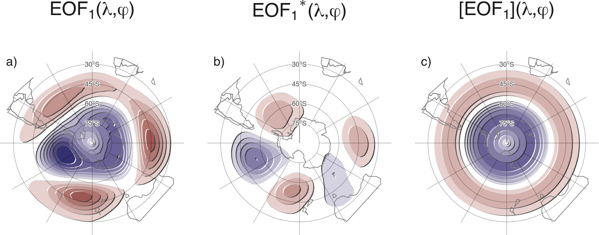
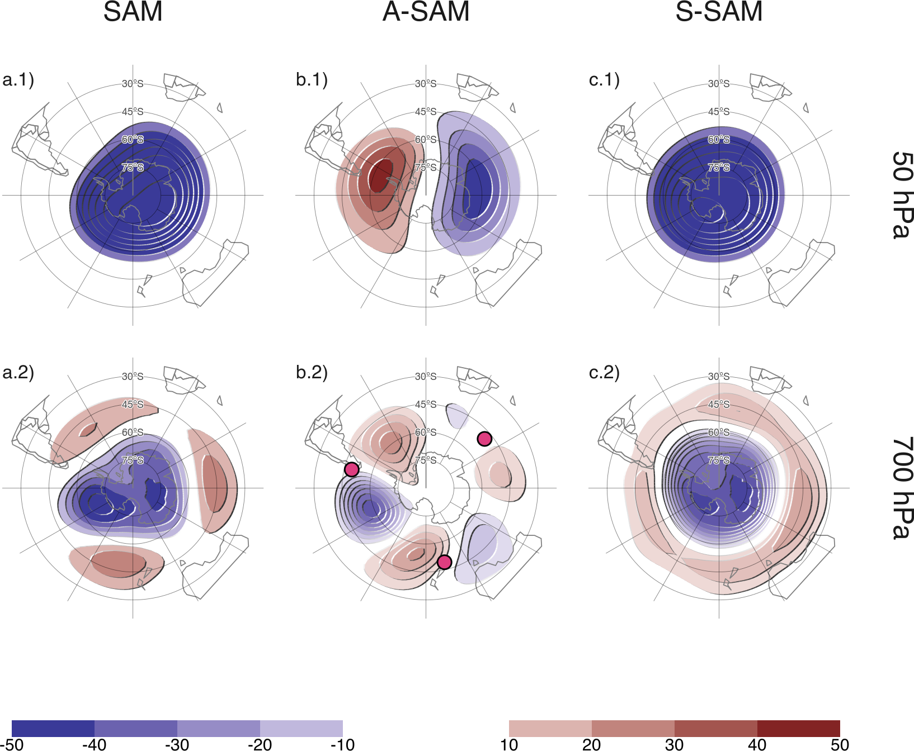

```{r setup, include=FALSE}
knitr::opts_chunk$set(echo = FALSE)

# Learn more about creating websites with Distill at:
# https://rstudio.github.io/distill/website.html

# Learn more about publishing to GitHub Pages at:
# https://rstudio.github.io/distill/publish_website.html#github-pages

```

# What is the Asymmetric SAM

The Southern Annular Mode (SAM) is the main mode of variability in the Southern Hemisphere extratropical circulation [@rogers1982] on daily, monthly, and decadal timescales [@baldwin2001a; @fogt2006] and exerts an important influence on temperature and precipitation anomalies, and sea ice concentration [e.g. @fogt2020].
Its positive phase is usually described as anomalously low pressures over Antarctica surrounded by a ring of anomalous high pressures in middle-to-high latitudes, but on top of that zonally symmetrical description, the SAM holds noticeable deviations from zonal symmetry (Figure \@ref(fig:method))

```{r method, fig.cap = "Spatial patterns of the first EOF of 700~hPa geopotential height for 1979 -– 2018 period. (a) Full field, (b) zonally asymmetric component and (c) zonally symmetric component. Arbitrary units; positive values in blue and negative values in red."}

```


We derived a Asymmetric SAM index (A\nobreakdash-SAM) and a Symmetric SAM (S\nobreakdash-SAM) by computing the SAM as the leading EOF of geopotential height South of 20ºS (Fig. \@ref(fig:method)a), splitting that field into it's zonally asymmetric part (Fig. \@ref(fig:method)b) and zonally symmetric part (Fig. \@ref(fig:method)c) and finally projecting monthly geopotential fields onto each of these two new fields. 
The three indices are then normalized by dividing them by the standard deviation of the SAM index at each level.
As a result, the magnitudes between indices are comparable, but only SAM index has unit standard deviation per definition.


```{r 20-regr, fig.cap = "Regression of geopotential height (meters) at (row 1) 50~hPa and (row 2) 700~hPa with (column a) SAM, (column b) A\\nobreakdash-SAM, and (column c) S\\nobreakdash-SAM for the 1979 -- 2018 period. The regression patterns for A\\nobreakdash-SAM and S\\nobreakdash-SAM are the result of one multiple regression using both indices. Points marked on panel b.2 are the location of the reference points used by @raphael2004 for their Zonal Wave 3 index."}

```

The resulting indices separate the zonally symmetric and zonally asymmetric part of the SAM (Figure \@ref(fig:20-regr)) and are associated with different impacts on temperature and precipitation. 

For more details, see @campitelli2021 and [the companion blog post](https://eliocamp.github.io/scrapbook/posts/2021-08-09-asymsam/).


# Get the data

You can grab the monthly indices for the 1979 -- 2018 period in [csvy](https://csvy.org/) format [here](data/indices.csv). 


# How to cite

If you use this data on your research, please cite it with

Campitelli, E., Díaz, L. B., & Vera, C. (2021). Assessment of zonally symmetric and asymmetric components of the Southern Annular Mode using a novel approach. Climate Dynamics. https://doi.org/10.1007/s00382-021-05896-5


Bibtex entry:


```
@article{campitelli2021,
  title = {Assessment of Zonally Symmetric and Asymmetric Components of the {{Southern Annular Mode}} Using a Novel Approach},
  author = {Campitelli, Elio and Díaz, Leandro B. and Vera, Carolina},
  date = {2021-08-09},
  journaltitle = {Climate Dynamics},
  shortjournal = {Clim Dyn},
  issn = {1432-0894},
  doi = {10.1007/s00382-021-05896-5},
  url = {https://doi.org/10.1007/s00382-021-05896-5}
}

```
